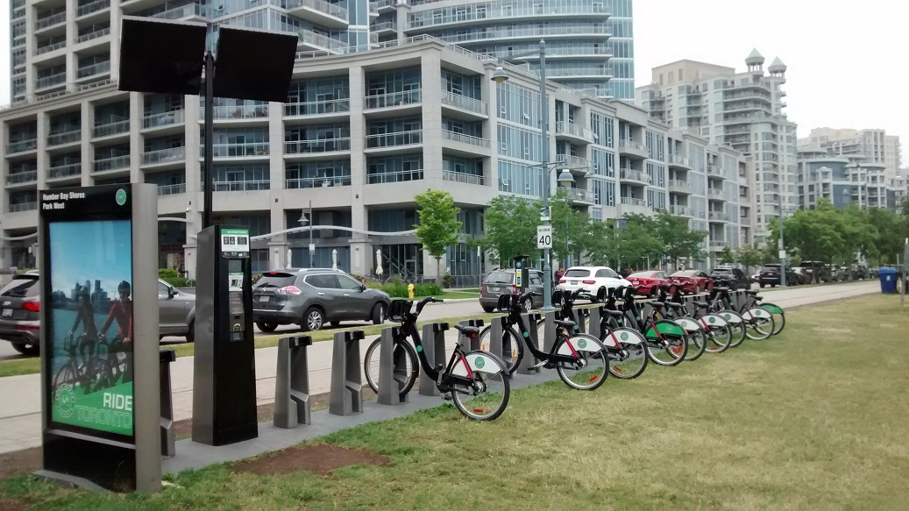

# Project Introduction

Our focus has been on six areas of ongoing/continuing multi-year work. In these areas, we welcomed brief project charters from industry that proposed the scope, mandate, and contain the system specification (design approach and requirements).

1. Facilities: Bicycle Rental/Parking Lot/Vision System
2. Building Automation: Greenhouse/SolarPanel/Home
3. Consumer: Entertainment Protocol DMX/Baby Monitoring Project
4. Education: Robust Hackable Educational Project
5. Robotics: Control/Navigation/Dashboard
6. Health and Wellness: Wearable 

Currently getting up to speed with the state of the art has been a challenge let alone making a contribution. For example, a modern parking lot will contain vehicle sensors, license plate recognition, RFID/transponders, etc.

Regarding a more accessible project example, there was a time that one would go to a bicycle rental company's shack, provide something of value as a deposit and the person working at the shack would provide a bicycle on the understanding that you would return it along with payment for the amount of time that you used it in exchange for return of your deposit.

Times have changed, now you use your smart phone to provide your credit card information to the bicycle rental company and then you are provided the code to unlock a bicycle and you are charged based on when you next lock it up.

The Computer Engineering Technology capstone consists of creating project similar to this. In this example there is a lock mechanism, a set of buttons to enter a code, lights and sound to provide feedback.

In CENG 317, students learn how to create the embedded modules. In CENG 322, students learn how to write the corresponding app. In CENG 355, the group would package everything up together as a functioning prototype.

- Overall project maximum dimensions of 12 13/16" x 6" x 2 7/8" (32.5cm x 15.25cm x 7.25cm) which represents the space below the tray in the parts kit.
- Project case to be designed for 3D printing/laser cutting.
- Keeping safety and Z462 in mind, the highest AC voltage that is to be used is 16Vrms from a wall adapter from which +/- 15V or as high as 45 VDC can be obtained. Maximum power consumption is to be 20 Watts.
- We work with prototypes and prototypes are not to be left powered unattended.

## Project Examples
- Automated plant watering system
- Living environment monitoring system
- Pet food dispenser
- Aquarium monitor
- Wellness monitor
- Envirorover which measures temperature, humidity, and light as it moves
- Waste bin monitoring system

## Your Existing Sense Hat
In addition to power and ground the sense hat uses:   
pin 3 -- GPIO2 or SDA   
pin 5 -- GPIO3 or SCL   
pin 16 -- GPIO23 (IMU Interrupt)   
pin 18 -- GPIO24 (IMU Interrupt)   
pin 22 -- GPIO25 (Atmel Prog Reset)   
pin 24 -- GPIO8 (Atmel Chip Reset)   
pin 27 -- GPIO0 (or maybe ID_SD or maybe EEPROM SDA or maybe HAT ID)   
pin 28 -- GPIO1 (or maybe ID_SC or maybe EEPROM SCL or maybe HAT ID)   
LED2472G connected via an Atmel ATTINY88 (0x46)   
LSM9DS1 IMU magnetometer 0x1c(0x1e) and accelerometer/gyroscope 0x6a(0x6b)   
LPS25H Pressure/Temperature sensor (0x5c)   
HTS221 Humidity/Temperature sensor (0x5f)   

## Additional sensor/effector choices:
1. Jared Craig [SparkFun Photodetector Breakout - MAX30101 (Qwiic)](https://www.sparkfun.com/products/16474) (0x57)
2. Robert Rowlison [SparkFun Ambient Light Sensor - VEML6030 (Qwiic)](https://www.sparkfun.com/products/15436) (0x48)
3. Faraz Ahmed [SparkFun Qwiic Mini ToF Imager - VL53L5CX](https://www.sparkfun.com/products/19013) (0x52)
4. Nathaniel Lozano [SparkFun 9DoF IMU Breakout - ICM - 20948](https://www.sparkfun.com/products/15335) (0x69, 0x68 with Jumper)
5. Abdicasis Ali [SparkFun Temperature Sensor - STTS22H (Qwiic)](https://www.sparkfun.com/products/21262) (0x3C)
6. Kaiden Phillip [SparkFun RFID Qwiic Reader](https://www.sparkfun.com/products/15191) and [RFID Reader ID-12LA (125 kHz)](https://www.sparkfun.com/products/11827) (0x7D)
7. Damanpreet Singh [SparkFun Spectral Sensor Breakout - AS7262 Visible (Qwiic)](https://www.sparkfun.com/products/14347) (0x49)
8. Illia Popov [Ultrasonic Distance Sensor with I2C Interface](https://www.adafruit.com/product/4742) (0x57 doesn't share I2C 100%)
9. Aaron Morris Jara [Person Sensor by Useful Sensors](https://www.sparkfun.com/products/21231) (0x62)
10. Muhammad Desai [SparkFun Humidity Sensor Breakout](https://www.sparkfun.com/products/16467) (0x70)
